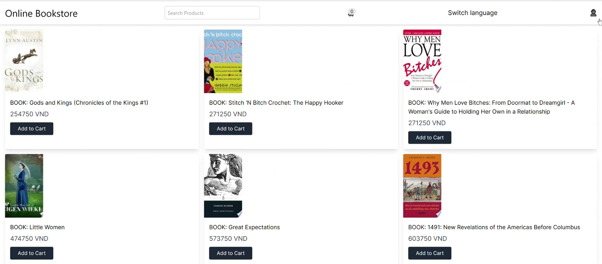

# Online Bookstore

## Nhóm :
Thành viên:
1. Hà Như Ý - 22022636
2. Nguyễn Mạnh Cường - 22022516
3. Đoàn Nhật Bình - 22022543

## Tổng quan
Online Bookstore là trang web thương mại điện tử dành cho những người yêu sách. Với kho sách phong phú từ các tác phẩm văn học kinh điển đến sách kỹ năng, học thuật, và sách mới nhất, chúng tôi cam kết mang đến cho người dùng trải nghiệm mua sắm tiện lợi và thú vị. 

## Tính năng
- **Quản lý Sản phẩm**: Thêm, chỉnh sửa, xóa, và xem chi tiết sản phẩm.
- **Quản lý Người dùng**: Đăng ký, đăng nhập, và quản lý hồ sơ cá nhân.
- **Gợi ý sản phẩm**: Tạo gợi ý dựa trên hành vi người dùng.
- **Giỏ hàng và Thanh toán**: Quản lý giỏ hàng và xử lý thanh toán an toàn.
- **Theo dõi Đơn hàng**: Kiểm tra trạng thái và tiến trình đơn hàng.
- **Chuyển đổi ngôn ngữ**: Hỗ trợ đa ngôn ngữ (tiếng Anh và tiếng Việt).

## Hướng dẫn sử dụng
- **Đăng ký/Đăng nhập**: Người dùng có thể tạo tài khoản và đăng nhập để sử dụng các dịch vụ của trang web.
- **Quản lý sản phẩm**: Quản trị viên có thể thêm, chỉnh sửa, xóa sản phẩm từ bảng điều khiển.
- **Mua hàng**: Người dùng có thể thêm sản phẩm vào giỏ hàng, cập nhật số lượng và tiến hành thanh toán.
- **Theo dõi đơn hàng**: Kiểm tra trạng thái và tiến trình giao hàng của đơn hàng đã đặt.

## Đóng góp
Nếu bạn muốn đóng góp vào dự án này, vui lòng làm theo các bước sau:
1. Fork dự án.
2. Tạo một nhánh tính năng mới (`git checkout -b feature/AmazingFeature`).
3. Commit các thay đổi của bạn (`git commit -m 'Add some AmazingFeature'`).
4. Push nhánh của bạn (`git push origin feature/AmazingFeature`).
5. Mở một Pull Request.
